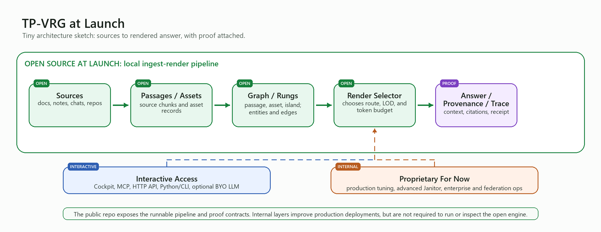

# TLDR-G — Contracts & Verification

TLDR-G is a local-first **knowledge rendering engine**: it turns source material into a graph and renders query-specific, source-grounded context at the right level of detail under a token budget — not a RAG wrapper, not a hosted memory SaaS.

**This repository is the open boundary of TLDR-G — its contracts and its offline verification surface, not the engine itself.** It lets you (a) integrate against the stable boundary contracts and (b) independently verify any artifact the engine produces, without trusting a server. The rendering engine is the product; this repo is how you build against it and check its outputs.

> **A note on names:** the product is **TLDR-G**. The Python package you import is `tp_vrg` and the verification CLI is `tp-vrg-verify` — these keep the engine's internal names on purpose, so an integration written against this repo runs unchanged against the real engine.



## What's in here

- **Boundary contracts** — `docs/contracts/` (the artifact + render-trace formats) and `src/tp_vrg/adapters/` (the adapter interface a host integrates against). The two exportable boundary objects are the `PortableArtifact` (a rung-level subgraph export, GDPR Art-20 shaped) and the render trace (the answer + citations "memory you can audit" record).
- **Offline attestation / verify** — `src/tp_vrg/attestation.py` + the `tp-vrg-verify` CLI: Ed25519 detached signatures over those artifacts (same family as Sigstore / Certificate Transparency / eIDAS 2.0 qualified seals — **not** a blockchain, no token, no ledger). Anyone holding an exported artifact can run `tp-vrg-verify <file>` and check tamper-evidence offline.
- **Provenance audit** — `tools/provenance_audit.py`: a stdlib-only tool that checks every cited snippet in a render trace actually exists in the source material — the "no hallucinated citations" proof.

## What's NOT in here

The rendering engine itself — ingestion, scoring, the render selector, the Janitor, partition/bake, mode profiles, and the runnable MCP / HTTP / Cockpit surfaces. Those are the product. This repo is the **integration + verification** surface: build against a stable boundary and prove the engine's outputs are faithful, without the engine source. **To run against a real engine, see "Running against a real engine" below.**

## Running against a real engine

The engine ships as a **free local application** — no cloud, no API key, runs on a laptop:

- the **Cockpit desktop app** — ingest your own sources, query them, and watch the engine show its own reasoning (render confidence, the intent it inferred, the tokens it saved, the questions it thinks you haven't asked yet); and
- **`tp-vrg-mcp`**, an MCP server any agent client (Claude Desktop, Cursor, …) can call as a tool.

**Get the engine:** download the latest release from the **Releases** page of this repository, or from **[tldr-g.ai](https://tldr-g.ai)**.
_(During the pre-launch period the public build isn't posted yet — email `niclas@tldr-g.ai` for an early build.)_

**Free during launch.** The full local engine is **free for early adopters during the launch period.** After that it moves to a tiered model — a free local tier for everyday use, paid tiers for higher capacity and the sovereign / enterprise build — and early-adopter installs keep working. Whatever tier you run, the artifacts it produces (the render trace and the portable artifact) are exactly the objects this repo's contracts describe and `tp-vrg-verify` checks — so your integration and your verification don't change when the pricing does.

**Commercial / sovereign.** On-prem, air-gapped, GDPR erasure + portability, signed attestation, and support are the Enterprise tier — `niclas@tldr-g.ai`.

## Quickstart (no engine, no API key)

```bash
python -m venv .venv
# Windows: .venv\Scripts\activate   •   macOS/Linux: source .venv/bin/activate
pip install -e .
python examples/quickstart.py
```

`examples/quickstart.py` signs a sample artifact, verifies it offline, then tampers one byte and shows verification fail — the whole trust story in ~20 lines.

## Tests

```bash
pip install -e ".[dev]"
python -m pytest -q
```

## Status

Private, pre-launch candidate — please don't redistribute. _(At launch this note is removed and the engine download link above goes live.)_
