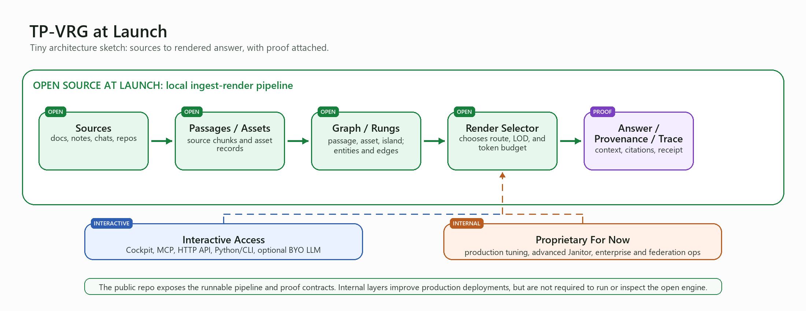

# TLDR-G — Contracts & Verification

TLDR-G is a local-first **knowledge rendering engine**: it turns your source material into a graph and **renders** query-specific, source-grounded context at the right level of detail under a token budget — instead of retrieving chunks and stuffing them into a prompt. Not a RAG wrapper, not a hosted memory SaaS. Think of a real-time 3D game engine's discipline — level-of-detail, culling, a fixed frame budget — applied to **language instead of graphics**.

**This repository is the open boundary of TLDR-G** — its integration contracts and its offline verification surface. It lets you (a) build against a stable boundary and (b) independently verify any artifact the engine produces, without trusting a server. **The engine itself is a free local app — download it below.**

> **A note on names:** the product is **TLDR-G**. The Python package you import is `tp_vrg` and the verify CLI is `tp-vrg-verify` — these keep the engine's internal names on purpose, so an integration written against this repo runs unchanged against the real engine.



## Get the engine (free)

The engine runs **entirely on your machine** — no cloud, no API key:

- the **Cockpit desktop app** — ingest your own sources, query them, and watch the engine show its reasoning (the context it rendered, the intent it inferred, the tokens it saved); and
- **`tp-vrg-mcp`** — an MCP server any agent client (Claude Desktop, Cursor, …) can call as a tool.

**Requirements (v0.1):** Windows 10/11 (64-bit). An **NVIDIA GPU with ≥4 GB VRAM is strongly recommended** (GTX 1060 6 GB or better) — it runs on CPU-only, but ingest and query are roughly **20–50× slower**. **16 GB RAM recommended.** The installer is small; **~3 GB of models download once on first launch** (internet needed that first time). *macOS and Linux are fast-follow.*

**Download:** the **Releases** page of this repo, or **[tldr-g.ai](https://tldr-g.ai)**.
**It's free.** Today the full local engine is **free to download and run** — that's the real, current offering, not a teaser. *(There's no metered cloud and no paywall on the local app; if a tiered model arrives later, a free local tier stays, and early installs keep working.)*

## See it: the visual demo (nothing to install)

**[tldr-g.ai/visual-demo](https://tldr-g.ai/visual-demo/) — the architecture with the hood up.** A corpus of documents drawn as terrain you can descend — continent, island, asset, passage — where brightness is **resolution**: how much of a node the engine actually paid for. The question sits in the command bar **unrun**, on purpose, because the first render should be your act rather than something that already happened before you arrived. Press it and you watch a resolution get chosen per node, a stated token budget get spent, and every choice accounted for afterwards — including the nodes the engine reached and **declined to pay for**, still drawn on the map, because omission is a budget decision and not a deletion. It's a static build: no server, no API key, no network. Source in [`visual-demo/`](visual-demo/); [`DEMO.md`](visual-demo/DEMO.md) is the guided walk for someone seeing it cold.

**Three things about it are true and worth saying before you click.** *The corpus is synthetic* — every document, entity, date and quote in it was manufactured by a seeded generator; the app stamps that on every response and shows it rather than filtering it out. Every figure on screen is a design concept, not a benchmark. *The engine behind it is not the engine* — the demo ships its own small in-process implementation of the same client seam the real engine serves, which is how the whole thing fits in a browser tab. *The signing key authenticates nothing* — a fixed keypair whose private half is printed in the source, published under a reserved `.example` domain that cannot be registered. It is there so a reviewer can verify a receipt offline and reproduce every byte of it, and for nothing else.

What is *not* synthetic is the instrument. The hashes are real SHA-256 over the verbatim bytes, the signatures are real Ed25519, verification runs locally — you do not ask the party that issued a receipt whether the receipt is good — and the *Break it on purpose* control mutates the real bytes and re-runs the demo's own verifier for real rather than flipping a badge, so an altered quote and an altered signature fail differently and the panel says which. A worthless key over a manufactured corpus is also the cleanest way to show the split the contracts in this repo insist on: tamper-evidence is something an envelope can prove by itself; **who signed it is not.** For that you resolve the signer — and this signer resolves to nothing, deliberately.

> The demo's trust code is built to be worthless and is **not** the verifier. Its receipts are `visual-demo-trace-v1`, a shape of its own, and they do not interoperate with the artifacts specified in `docs/contracts/`. The real verifier is `tp-vrg-verify` — a separate implementation with a real identity.

## What's in this repo

- **Boundary contracts** — `docs/contracts/` (the artifact + render-trace formats) and `src/tp_vrg/adapters/` (the interface a host integrates against). The two exportable boundary objects: the `PortableArtifact` (a rung-level subgraph export, GDPR Art-20 shaped) and the render trace (the answer + citations — "memory you can audit").
- **Offline attestation / verify** — `src/tp_vrg/attestation.py` + the `tp-vrg-verify` CLI: Ed25519 detached signatures over those artifacts (same family as Sigstore / Certificate Transparency / eIDAS 2.0 qualified seals — **not** a blockchain, no token, no ledger). Anyone holding an exported artifact runs `tp-vrg-verify <file>` and checks tamper-evidence offline.
- **[`visual-demo/`](visual-demo/)** — the source for the demo above, and the scripts that check its own claims (`node scripts/verify-trust.mjs` rebuilds the corpus, signs a trace, tampers with real bytes, and exits non-zero if a figure drifted).
- **Provenance audit** — `tools/provenance_audit.py`: a stdlib-only tool that checks every cited snippet in a render trace actually exists in the source — the "no hallucinated citations" proof.

## Why provenance + attestation are front-and-centre

Most AI fails the question *"where exactly did this come from, and can you prove it didn't change?"* For a lot of people that's a nuisance. For **regulated and public-sector organisations — law, healthcare, finance, government — it's the whole ballgame:** they can't put a black-box cloud model between themselves and a decision they have to defend, and they can't let sensitive data leave their jurisdiction. TLDR-G is built so the answer to that question is **yes, here's the receipt, verify it yourself, and nothing left your machine.** That's why verifiable provenance + local sovereignty are the spine of the product, not a feature bolted on — and it's who the eventual commercial offering will serve first.

**We're looking for design partners.** If you're in one of those domains (or building agents that need auditable memory) and want to shape what this becomes, we'd love to talk: **`niclas@tldr-g.ai`**. No commercial product to sell you today — an engine to build with, and a conversation about where it should go.

## Your data: one mechanism for anti-silo *and* privacy

TLDR-G crosses boundaries for a living. The same primitive **moves and merges knowledge between documents in your graph, between a team's silos, and — as it federates — between whole organizations.** It crosses every one of those boundaries the same way: by sharing a **signed attestation — a claim plus a content hash — never the source text.** "Break the silo, keep the secret" is not a balance we strike; it is a single mechanism. **Anti-silo at every scale, content-free by construction** — and because the boundary-crossing object is structurally incapable of carrying the data it attests to, the privacy property is a fact about the wire format, not a promise about our behaviour.

So your data stays yours without you giving anything up:

- **Local-first by default.** Ingestion runs on-device with no model calls, your knowledge graph is a single local file, and an air-gapped install sends nothing — ever.
- **Federation crosses organizational boundaries with attestations, not content** (a future capability — no federation runs today). A participant shares only the connections it chooses to attest; a data-less attestation cannot carry the data beneath it.

The one optional outbound we're building is **a contribution you choose, not a tax you pay**: an opt-in, content-free, aggregate signal about *how* the engine rendered, which improves the shared default packs everyone benefits from — never your documents or queries, never one user exposed to another, fully inspectable, and **off until its privacy guarantee is provable** (so today it sends nothing).

## Open by design

The boundary you build against is **open (Apache-2.0)** so your integration and your verification never depend on us staying in business. Beyond this repo, we're publishing more of the *method* — design notes, a few standalone primitives, and a starter-kit of the AI-augmented development harness this project runs on — as a generous bonus to anyone building in the space. Watch the repo / [tldr-g.ai](https://tldr-g.ai) for the drops. *(The production engine stays a closed, free binary — open contracts, not open-core. Principle, not recipe.)*

## Quickstart (no engine, no API key)

```bash
python -m venv .venv
# Windows: .venv\Scripts\activate   •   macOS/Linux: source .venv/bin/activate
pip install -e .
python examples/quickstart.py
```

`examples/quickstart.py` signs a sample artifact, verifies it offline, then tampers one byte and shows verification fail — the whole trust story in ~20 lines.

## Tests

```bash
pip install -e ".[dev]"
python -m pytest -q
```

## Status

v0.1.0 — available now. Download from the **Releases** tab above or **[tldr-g.ai](https://tldr-g.ai)**.
